# CDL Slides

Compile Markdown files into beautiful CDL-themed [Marp](https://marp.app/) presentations. Includes the full Contextual Dynamics Lab slide theme with bundled fonts, images, and CSS.

## Theme gallery

| Title Slide | Callout Boxes | Tip & Warning |
|:-----------:|:-------------:|:-------------:|
|  | 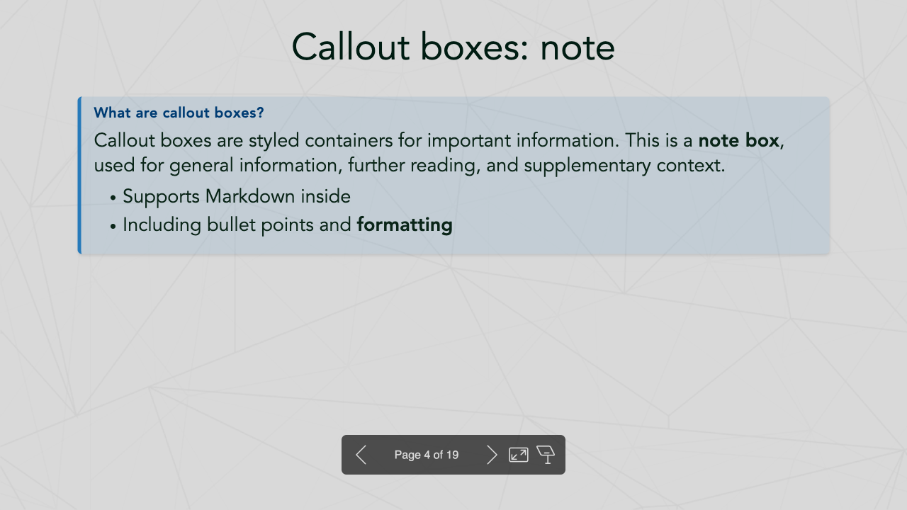 | 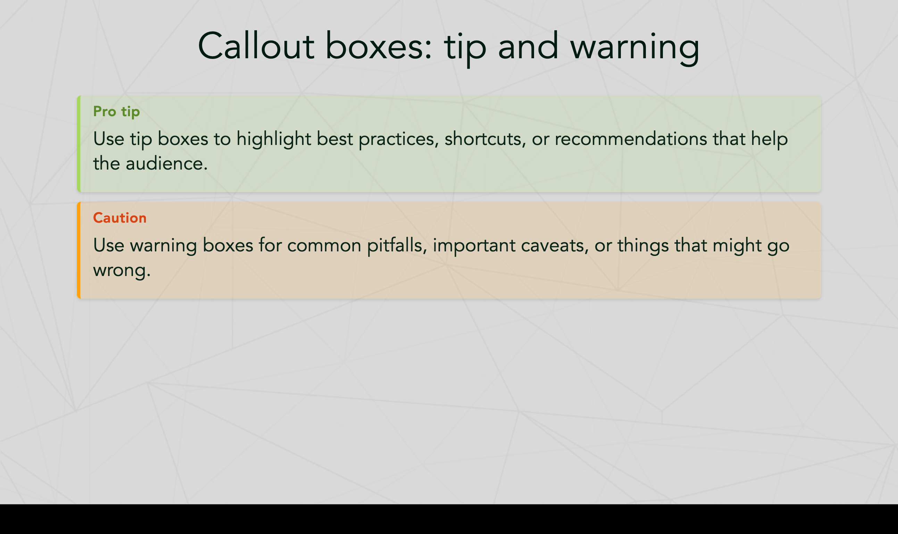 |

| Definition, Example & Important | Code Highlighting | Math (KaTeX) |
|:-------------------------------:|:-----------------:|:------------:|
| 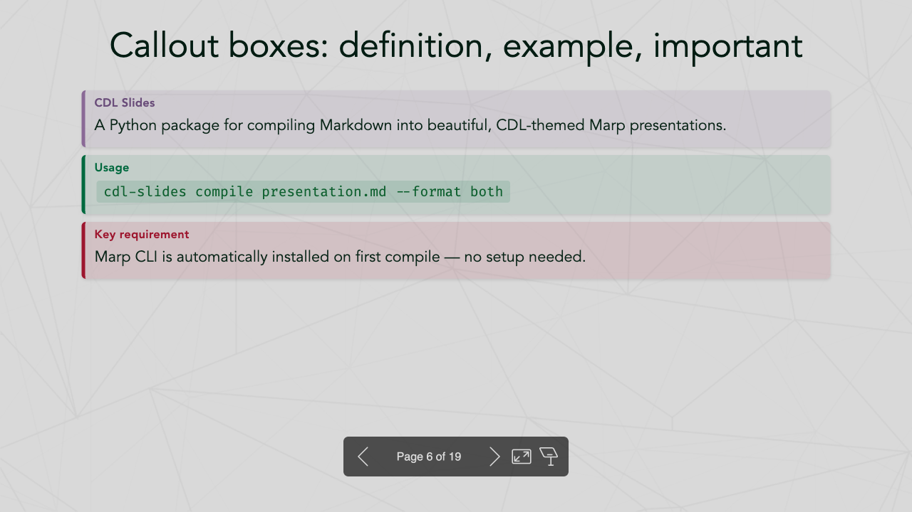 | 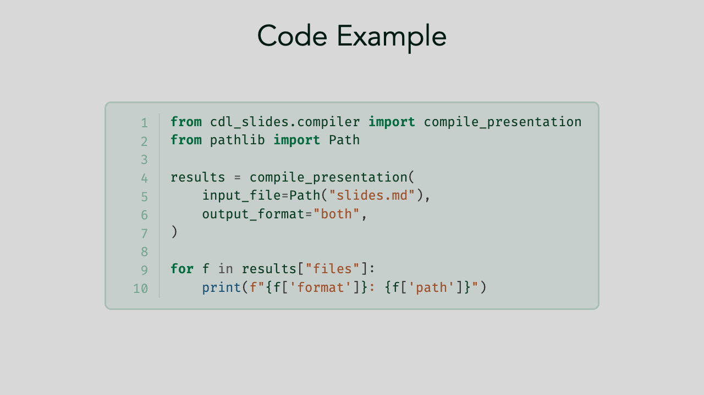 | 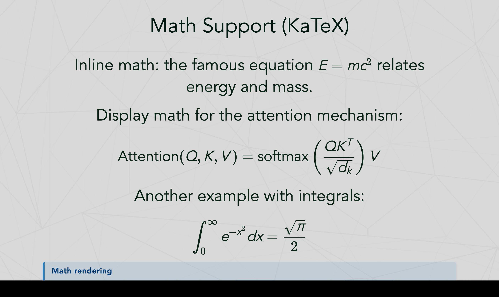 |

| Manim Animations | Animate DSL | Flow Diagrams |
|:----------------:|:-----------:|:-------------:|
| 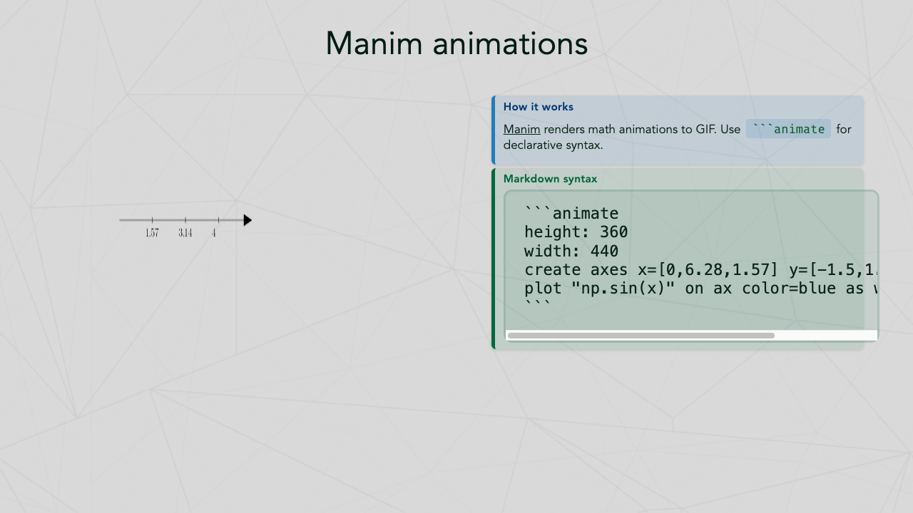 | 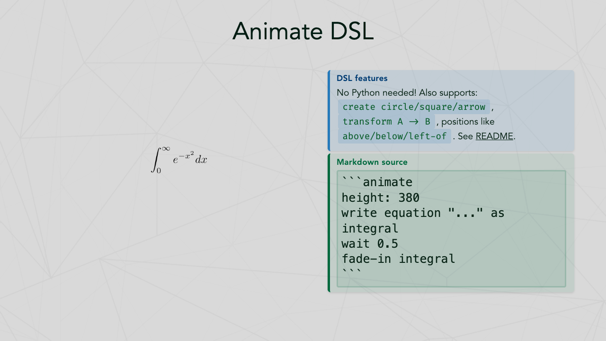 | 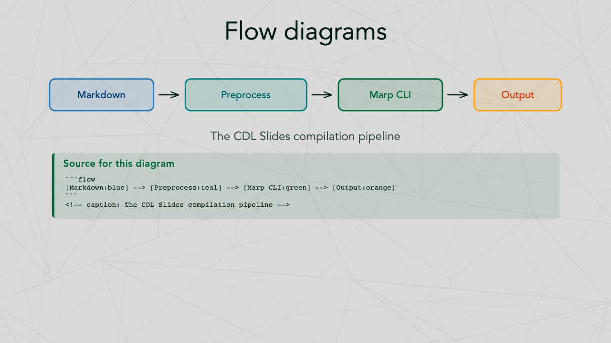 |

| Emoji Figures | Two-Column Layout | Simple Table |
|:-------------:|:-----------------:|:------------:|
| 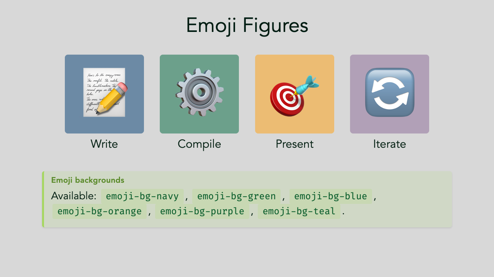 | 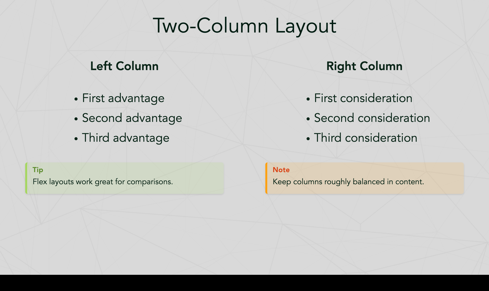 | 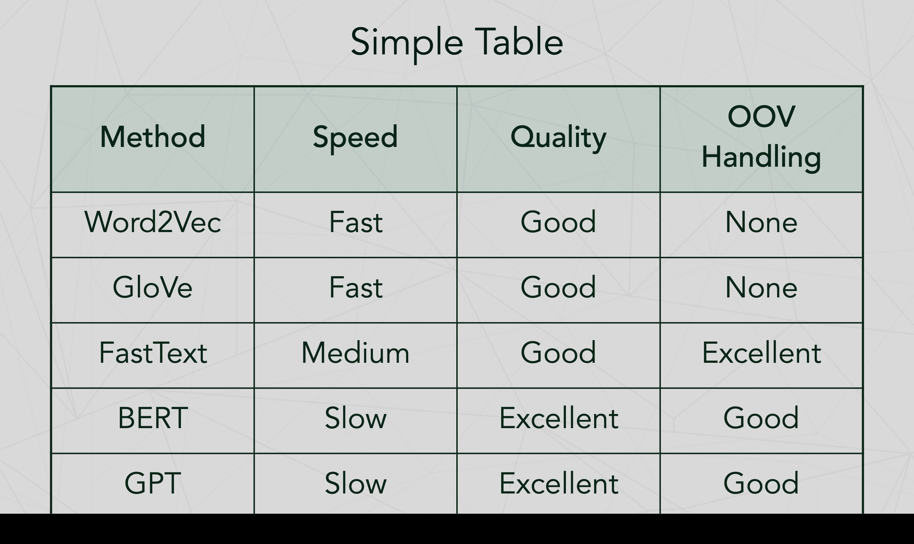 |

| Output Formats |
|:--------------:|
| 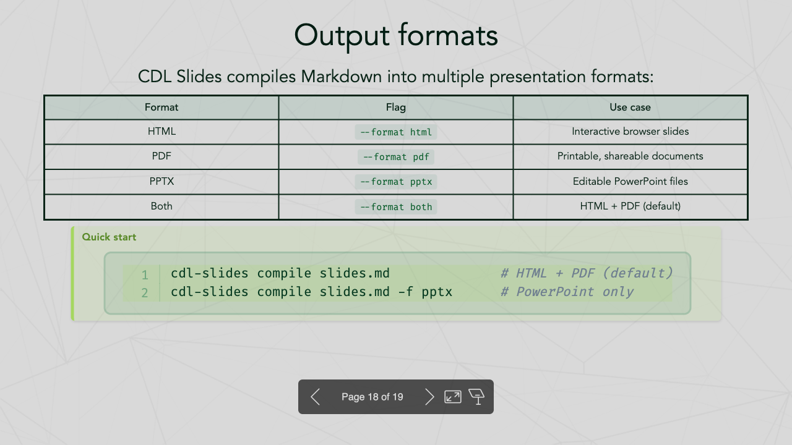 |

## Table of contents

- [Features](#features)
- [Installation](#installation)
- [Quick start](#quick-start)
- [CLI reference](#cli-reference)
- [Slide authoring guide](#slide-authoring-guide)
  - [Front matter](#front-matter)
  - [Callout boxes](#callout-boxes)
  - [Two-column layouts](#two-column-layouts)
  - [Flow diagrams](#flow-diagrams)
  - [Manim animations](#manim-animations)
  - [Animate DSL](#animate-dsl-simplified-animation-syntax)
  - [Scale directives](#scale-directives)
  - [Emoji figures](#emoji-figures)
  - [Math (KaTeX)](#math-katex)
  - [Code blocks](#code-blocks)
  - [Tables](#tables)
  - [Arrow syntax](#arrow-syntax)
- [Bundled fonts](#bundled-fonts)
- [Development](#development)
- [License](#license)

## Features

- **Cross-platform**: Works on macOS, Windows, and Linux
- **Zero-config Marp CLI**: Automatically downloads the Marp CLI standalone binary on first use — no Node.js required
- **Multiple output formats**: HTML, PDF, and PPTX
- **Bundled theme**: Complete CDL/Dartmouth-branded theme with custom fonts, colors, and layouts
- **Smart preprocessing**: Auto-splits long code blocks and tables across slides
- **Flow diagrams**: Simple ```` ```flow ```` syntax for pipeline diagrams
- **Manim animations**: Embed animated equations and visualizations with ```` ```manim ```` blocks (optional)
- **Auto-scaling**: Automatically adjusts font size for dense slides
- **Syntax highlighting**: Code blocks with line numbers via Pygments
- **Math support**: KaTeX for inline and display equations
- **Callout boxes**: Note, tip, warning, definition, example, and important boxes

## Installation

```bash
pip install cdl-slides
```

That's it. Marp CLI is automatically downloaded on first compile if not already installed.

For **manim animations** (optional), install with the animations extra:

```bash
pip install cdl-slides[animations]
```

This installs manim and bundled ffmpeg. Note: manim requires system libraries (pango, cairo) on Linux — see [manim installation docs](https://docs.manim.community/en/stable/installation.html) if you encounter issues.

Or install from source:

```bash
git clone https://github.com/ContextLab/cdl-slides.git
cd cdl-slides
pip install -e .            # Basic install
pip install -e ".[animations]"  # With animation support
```

### Marp CLI resolution

`cdl-slides` finds or installs Marp CLI automatically in this order:

1. **System PATH** — uses your existing `marp` install (npm, brew, etc.)
2. **Cached binary** — standalone binary downloaded on first use (~`~/Library/Caches/cdl-slides/` on macOS, `~/.cache/cdl-slides/` on Linux, `AppData\Local\cdl-slides\` on Windows)
3. **npx fallback** — runs `@marp-team/marp-cli` via npx if Node.js is available

To check your Marp CLI status:

```bash
cdl-slides version
```

## Quick start

1. Create a Markdown file with CDL theme front matter:

```markdown
---
marp: true
theme: cdl-theme
math: katex
transition: fade 0.25s
author: Contextual Dynamics Lab
---

# My Presentation Title
### Subtitle

Your Name
Your Institution

---

# Slide Two

- Point one
- Point two
- Point three
```

2. Compile to HTML and PDF:

```bash
cdl-slides compile my_presentation.md
```

3. Output files are created alongside the input:
   - `my_presentation.html`
   - `my_presentation.pdf`

## CLI reference

### `cdl-slides compile`

Compile a Markdown file into a presentation.

```
Usage: cdl-slides compile [OPTIONS] INPUT_FILE

Options:
  -o, --output PATH      Output file or directory (default: same dir as input)
  -f, --format TEXT       Output format: html, pdf, pptx, both (default: both)
  -l, --lines INTEGER     Max code lines per slide before splitting (default: 30)
  -r, --rows INTEGER      Max table rows per slide before splitting (default: 10)
  --no-split              Disable auto-splitting of code blocks and tables
  --keep-temp             Keep temporary processed files for debugging
  -t, --theme-dir PATH    Custom theme directory (overrides bundled CDL theme)
  --help                  Show this message and exit.
```

**Examples:**

```bash
# Compile to HTML only
cdl-slides compile slides.md --format html

# Compile to PDF only
cdl-slides compile slides.md --format pdf

# Compile to PowerPoint
cdl-slides compile slides.md --format pptx

# Compile with custom output location
cdl-slides compile slides.md --output ./build/

# Compile with custom code splitting threshold
cdl-slides compile slides.md --lines 15 --rows 5
```

### `cdl-slides init`

Create a new presentation from a template.

```bash
cdl-slides init                    # Create template in current directory
cdl-slides init ./my-presentation  # Create template in specific directory
```

### `cdl-slides version`

Show version and Marp CLI status.

```bash
cdl-slides version
```

## Slide authoring guide

### Front Matter

Every CDL presentation starts with this YAML front matter:

```yaml
---
marp: true
theme: cdl-theme
math: katex
transition: fade 0.25s
author: Contextual Dynamics Lab
---
```

### Callout Boxes

The CDL theme includes six styled box types:

```html
<div class="note-box" data-title="Title">
Content here with **Markdown** support.
</div>

<div class="tip-box" data-title="Pro Tip">
Helpful advice goes here.
</div>

<div class="warning-box" data-title="Caution">
Important warnings here.
</div>

<div class="definition-box" data-title="Term">
Definition of the term.
</div>

<div class="example-box" data-title="Example">
A worked example.
</div>

<div class="important-box" data-title="Key Point">
Critical information.
</div>
```

### Two-Column Layouts

For two-column content, wrap each column's content in a callout box for best results:

```html
<div style="display: flex; gap: 1.5em;">
<div style="flex: 1;">

<div class="example-box" data-title="Left topic">

- First point
- Second point

</div>

</div>
<div style="flex: 1;">

<div class="example-box" data-title="Right topic">

- First point
- Second point

</div>

</div>
</div>
```

Any box type works (`tip-box`, `warning-box`, `note-box`, etc.). The boxes give columns clear visual boundaries and headers.

### Flow Diagrams

Use the ```` ```flow ```` syntax for simple pipeline diagrams:

````markdown
```flow
[Input:blue] --> [Process:green] --> [Output:orange]
```
<!-- caption: A data processing pipeline -->
````

Available colors: `green`, `blue`, `navy`, `teal`, `orange`, `red`, `violet`, `yellow`, `gray`.

### Manim Animations

Embed animated math visualizations using the **Animate DSL** — a simple, declarative syntax that compiles to [Manim Community](https://www.manim.community/). Animations are rendered to transparent GIFs and embedded in slides.

**Requires:** `pip install cdl-slides[animations]`

FFmpeg is bundled automatically via `imageio-ffmpeg` — no system ffmpeg installation required.

**Usage:**

````markdown
```animate
height: 400
write equation "E = mc^2" as eq at center
wait 0.5
fade-in eq
```
````

The preprocessor automatically renders to GIF and embeds in your slide. Rendered GIFs are cached by content hash, so unchanged animations won't re-render.

### Animate DSL (Simplified Animation Syntax)

The animate DSL provides a simpler alternative to writing raw manim Python code. It uses a declarative syntax that gets transpiled to manim automatically.

**Basic equation example:**

````markdown
```animate
height: 400
write equation "E = mc^2" as eq1 at center
wait 0.5
fade-in eq1
```
````

**Graph/plot example:**

````markdown
```animate
height: 400
create axes x=[0,6.28,1.57] y=[-1.5,1.5,0.5] as ax
plot "np.sin(x)" on ax color=blue as wave
```
````

**Metadata options:**

| Option | Default | Description |
|--------|---------|-------------|
| height | 500 | Image height in pixels |
| width | 960 | Image width in pixels |
| quality | high | Render quality (low/medium/high) |
| scale | 1.0 | Scale factor for equations and text (e.g., 2.5 for larger) |

**Object commands:**

| Command | Description | Example |
|---------|-------------|---------|
| `write equation "LaTeX" as NAME` | Create LaTeX equation | `write equation "E = mc^2" as eq1` |
| `write text "string" as NAME` | Create text object | `write text "Hello" as title` |
| `create circle color=COLOR as NAME` | Create colored circle | `create circle color=blue as c1` |
| `create square color=COLOR as NAME` | Create colored square | `create square color=red as s1` |
| `create arrow color=COLOR as NAME` | Create colored arrow | `create arrow color=green as a1` |
| `create axes x=[min,max,step] y=[min,max,step] as NAME` | Create coordinate axes | `create axes x=[-3,3,1] y=[-1,1,0.5] as ax` |
| `create graph "formula" x=[min,max] color=COLOR as NAME` | Create standalone function graph | `create graph "x**2" x=[-2,2] color=red as parabola` |

**Plot commands:**

| Command | Description | Example |
|---------|-------------|---------|
| `plot "formula" on AXES color=COLOR as NAME` | Plot function on existing axes | `plot "np.sin(x)" on ax color=blue as wave` |

**Animation commands:**

| Command | Description |
|---------|-------------|
| `fade-in NAME` | Fade in an object |
| `fade-out NAME` | Fade out an object |
| `draw NAME` | Draw/create an object (for axes, graphs) |
| `transform NAME1 -> NAME2` | Transform one object into another |
| `wait SECONDS` | Wait for specified duration |

**Generic manim escape (for advanced use):**

| Command | Description | Example |
|---------|-------------|---------|
| `manim <python_code> as NAME` | Execute any manim code | `manim Dot().move_to(ax.c2p(1,1)) as dot` |

**Position modifiers:**

| Modifier | Description |
|----------|-------------|
| `at center` | Place at screen center |
| `above NAME` | Place above another object |
| `below NAME` | Place below another object |
| `left-of NAME` | Place to the left of another object |
| `right-of NAME` | Place to the right of another object |

**Available colors:** blue, red, green, yellow, orange, white, black

**Requires:** `pip install cdl-slides[animations]`

### Scale Directives

For dense slides, use scale directives to adjust font size:

```markdown
<!-- _class: scale-80 -->
# Dense Slide Title

Lots of content here...
```

Available scales: `scale-50` through `scale-95` in increments of 5.

Note: The preprocessor auto-injects scale classes when slides overflow, so manual scaling is rarely needed.

### Emoji Figures

```html
<div class="emoji-figure">
  <div class="emoji-col">
    <span class="emoji emoji-xl emoji-bg emoji-bg-navy">📊</span>
    <span class="label">Data</span>
  </div>
  <div class="emoji-col">
    <span class="emoji emoji-xl emoji-bg emoji-bg-green">🔬</span>
    <span class="label">Analysis</span>
  </div>
</div>
```

Available backgrounds: `emoji-bg-navy`, `emoji-bg-green`, `emoji-bg-blue`, `emoji-bg-orange`, `emoji-bg-purple`, `emoji-bg-teal`.

### Math (KaTeX)

Inline: `$E = mc^2$`

Display:
```
$$\int_0^\infty e^{-x^2} dx = \frac{\sqrt{\pi}}{2}$$
```

### Code Blocks

Code blocks are automatically:
- Syntax highlighted (via Pygments)
- Line numbered
- Split across slides if they exceed `--lines` threshold (default: 30)

### Tables

Markdown tables are automatically split across slides if they exceed `--rows` threshold (default: 10 data rows).

### Arrow Syntax

Use arrow shorthand in slides:

```markdown
A --[80]-> B --[lg]-> C
```

Options: `--[80]->` (pixel width), `--[lg]->` (named size: sm, md, lg, xl).

## Bundled Fonts

The package includes these fonts for consistent rendering across platforms:

- **Avenir LT Std** (Light, Book, Roman, Medium, Heavy, Black) — body text
- **Fira Code** (Regular, Medium, Bold) — code blocks
- **Noto Sans SC** (Variable) — CJK character support

## Development

```bash
# Clone and install in development mode
git clone https://github.com/ContextLab/cdl-slides.git
cd cdl-slides
pip install -e ".[dev]"

# Run tests
pytest tests/ -v

# Run linter
ruff check src/ tests/
ruff format src/ tests/
```

## License

MIT License. See [LICENSE](LICENSE) for details.

## Links

- **Repository**: https://github.com/ContextLab/cdl-slides
- **Lab Website**: https://www.context-lab.com
- **Marp**: https://marp.app/
